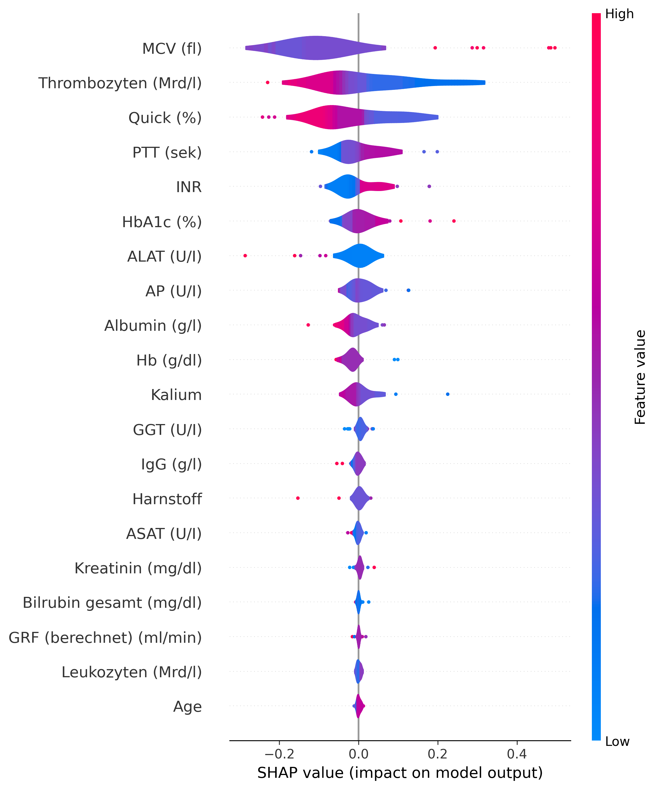
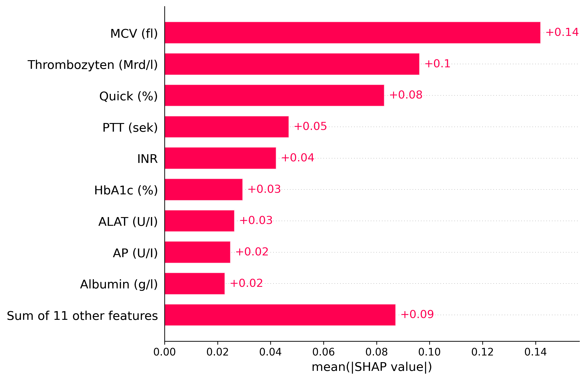
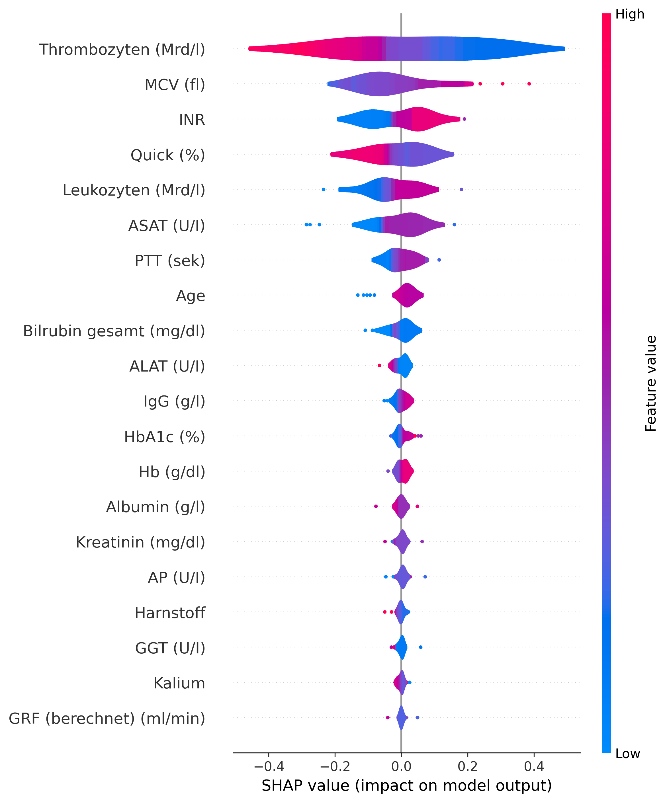
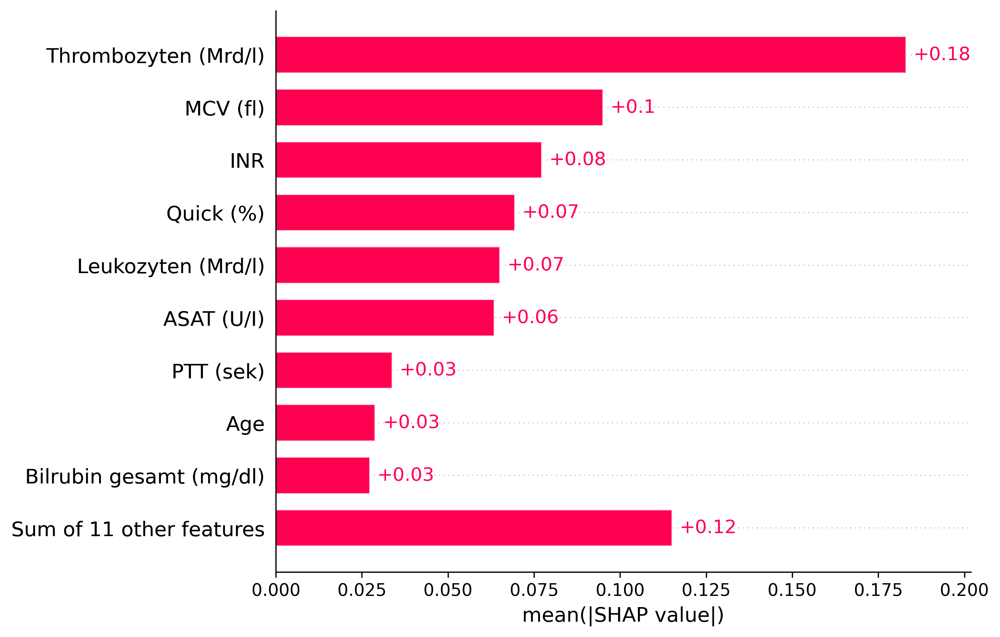

[//]: # ()

Dieser Code enthält ein Modell zur Bestimmung des Leberzustandes ("Liver-Staging") auf Basis der Blutbild-Biomarker der Patienten
für 4 unterschiedliche Präkdiktions-Task.

Bei Fragen, bitte eine Mail an [Marcus Buchwald](mailto:marcus.buchwald@medma.uni-heidelberg.de) oder an [Pascal Memmesheimer](mailto:pascal.memmemsheimer@medma.uni-heidelberg.de).

# Table of contents
1. [Daten](#Daten)
2. [Modelldetails](#Modelldetails)
3. [Prädiktion](#Prädiktion)
4. [Inferenz](#Inferenz)
5. [Output](#Output)
6. [Pip-Installierung](#Pip-Installierung)
7. [Docker-Installierung](#Docker-Installierung)
8. [TO-DOs](#TO-DOs)

--------------------- 

## Daten <a name="Daten"></a>

Die Daten (`\data\`) sind retrospektive Klinikdaten der Uninversitätsmedizin Mannheim der Uni Heidelberg und enthalten Labordaten einer Blutentnahme sowie Histologiedaten im Bezug auf eine mögliche Fettleberekrankung.

Die berücksichtigten Biomarker hierfür umfassen: 
- Hb (g/dl) 
- MCV (fl)
- Leukozyten (Mrd/l)
- Thrombozyten (Mrd/l)
- Kalium
- Albumin (g/l)
- Bilrubin gesamt (mg/dl)
- Harnstoff
- Kreatinin (mg/dl)
- GRF (berechnet) (ml/min)
- ASAT (U/I)
- ALAT (U/I)
- GGT (U/I)
- AP (U/I)
- IgG (g/l)
- Quick (%)
- INR
- PTT (sek)
- HbA1c (%)
- Glucose in plasma (mg/dL)
- LDL- Cholesterin (mg/dL)

--------------------- 


## Details zum Modell / Training <a name="Modelldetails"></a>

### Modell

Verwendet wird ein Bayesian Neural Network (BNN) um die Klassifikation auf Basis der angegebenen Symptome zu berechnen.
Trainiert und analysiert wurden eine Vielzahl an tree-based und deep-learning Modellen von (Credits: Pascal Memmesheimer) für das Projekt. Die analysierten 
Modelle sind:

- SVM
- RF
- XGB Boost
- Light GBM

- Multi Layer Perceptron
- BNN (variational inference)
- GANDALF
- Tab Transformer 

---------------------

## Prädiktion <a name="Prädiktion"></a>

Das Modelle geben eine binäre Prädiktion gibt Wahrscheinlichkeiten der einzelnen Stages auf Basis der Biomarker an. 








---------------------

## Inferenz / Verwendung des trainierten Modells <a name="Inferenz"></a>

Die Daten zum Testen des Modells sollen für Biomarkerwerte von Patienten mit einer `sub_id` in folgendem Format als `inference.csv` in `/src/data/` abgelegt werden.

Die Inferenz wird via Docker aufgerufen. Alternativ kann `\scr\inference.py` aufgerufen werden.


---------------------

## Output <a name="Output"></a>

Eine CSV wird erstellt in `\scr\output\result_inference.csv` welche die mit folgender Struktur:


--------------------- 

## Installierung via Pip <a name="Pip-Installierung"></a>

Für eine schnelle Installation:

Installiere Pytorch via: 

```
pip install torch==2.0.1 torchvision==0.15.2 torchaudio==2.0.2 --index-url https://download.pytorch.org/whl/cu118``
```
Um alle anderen Packages zu installieren, wird folgender Code im Terminal ausgeführt nachdem eine neue Conda environment angelegt wurde.

```
pip install -r requirements.txt
```
--------------------- 

## Installierung als Docker <a name="Docker-Installierung"></a>

Erstellung des Docker Image via `Dockerfile`. Die `Dockerfile` muss mit Docker ausgeführt werden.

### Container auf GPU ausführen 

Um den Container auf der GPU auszuführen, muss  `nvidia-container-toolkit` auf dem Host installiert werden.
Die Dockerfile wird daraufhin via `sudo docker compose up` auf Basis der `compose.yml` file ausgeführt.

Zum Ausführen des Containers:

```
sudo docker compose up
```

#### Anleitung zum Installieren von "nvidia-container-toolkit"

Für das Installieren von `nvidia-container-toolkit` bitte folgende Befehle im Terminal ausführen.
```
curl -fsSL https://nvidia.github.io/libnvidia-container/gpgkey | sudo gpg --dearmor -o /usr/share/keyrings/nvidia-container-toolkit-keyring.gpg \
  && curl -s -L https://nvidia.github.io/libnvidia-container/stable/deb/nvidia-container-toolkit.list | \
    sed 's#deb https://#deb [signed-by=/usr/share/keyrings/nvidia-container-toolkit-keyring.gpg] https://#g' | \
    sudo tee /etc/apt/sources.list.d/nvidia-container-toolkit.list
```

```
sudo sed -i -e '/experimental/ s/^#//g' /etc/apt/sources.list.d/nvidia-container-toolkit.list
```

```
sudo chmod 0644 /usr/share/keyrings/nvidia-container-toolkit-keyring.gpg
```

```
sudo apt update
```

```
sudo apt-get install -y nvidia-container-toolkit
```

```
sudo nvidia-ctk runtime configure --runtime=docker
```

Überprüfung ob `nvidia-smi` angezeigt wird via Docker wenn das Docker Image `ubuntu` ausgeführt wird.
```
sudo docker run --rm --runtime=nvidia --gpus all ubuntu nvidia-smi
```

Starte den "deamon" und "docker" neu:
```
sudo systemctl daemon-reload
```

```
sudo systemctl restart docker
```

--------------------- 

## TO-DOs <a name="TO-Dos"></a>


